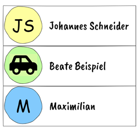
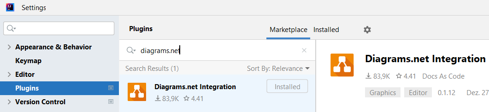

# SWEN1-WIN (Prof. Schneider), Blatt 2

Abgabe bis 31.10. per Git.

Kontrollieren Sie bitte, ob Commit und Push geklappt hat, 
da wir Ihre Abnahme wegen des Feiertags im Git kontrollieren.

## Hinweis Unit-Tests

Die Code-Vorlage im exercises-Projekt (SVN) enthält auch Unit-Tests. Kopieren
Sie daher sowohl das Verzeichnis `exercise02` aus `src` in Ihr `src`-Verzeichnis
als auch das Verzeichnis `exercise02` aus `test` in Ihr `test`-Verzeichnis.

Einige Aufgaben in diesem und folgenden Aufgabeblättern verlangen, dass mit
Ihrem Code alle Unit-Tests ohne Fehler durchlaufen. Wenn Sie dies nicht immer
schaffen, ist das in Ordnung. Wir besprechen dann in der Abnahme, wo es im
konkreten Fall noch hängt. Wichtig ist, dass Sie in diesem Fall nicht den
Unit-Test anpassen, sondern ihn so belassen, wie von mir vorgegeben.

## Aufgabe 1, Package person_initials

Die Methode `Person#getInitials` wirft einen Fehler
("NullPointerException"), wenn Sie den Code in `Exercise` ausführen.

Beheben Sie den Fehler, indem Sie die Methode `Person#getInitials` anpassen, so
dass keine `NullPointerException` mehr geworfen wird. Nehmen Sie an, diese
Methode wird in einer Chat-Applikation benutzt, um bei Teilnehmern ohne
Profilbild die Initialen anzuzeigen (z.B. das JS für Johannes Schneider).



Überlegen Sie, welche Fälle eintreten können und welche Rückgabe jemand
erwartet, der eine Methode "Initialen zurückgeben" aufruft. **Wichtig**:
Sie sollen nur den Code von `getInitials` ändern, nicht den restlichen Code von
`Person`.

## Aufgabe 2, Package bank_account

a) Installieren Sie in IntelliJ die "Diagrams.net Integration". Das geht über
File -> Settings. Dort finden Sie unter Plugins mit einer entsprechenden
Suche die Erweiterung:



Öffnen Sie anschließend die Vorlage
[bank_account/bank_account.drawio.png](bank_account/bank_account.drawio.png)
für ein UML-Klassen-Diagramm innerhalb IntelliJ. Sie sollten das Diagram
jetzt bearbeiten können (über den Tab "diagrams.net editor" unten).

Erstellen Sie ein UML-Klassendiagramm mit den Klassen `BankAccount` und
`Account`. Achten Sie auf alle Details (richtige Modifier, richtige Pfeile und
Pfeilspitzen).

Benutzen Sie dafür nicht die
UML-Palette aus draw.io - diese beinhaltet einige falsche und kompliziert zu
benutzenden Elemente, sondern die Elemente der Vorlage. Nicht-verwendete
Elemente können Sie am Ende löschen.

b) Implementieren Sie die `toString`-Methode von `BankAccount`, so dass sie
`BankAccount{nr=<Nummer>, name=<name>, balance=+/-abc.de}` anzeigt, z.B.
`BankAccount{nr=47112334, name=WG-Konto, balance=+101.48}` (Balance soll in Euro
mit zwei Nachkommastellen sein und + oder - anzeigen, je nach ob, der Betrag >=
0 oder < 0 ist). Testen Sie, ob Ihre Implementierung korrekt ist, indem Sie
BankAccountTest ausführen. Es sollten alle Test-Methoden funktionieren. Wenn Sie
einen Fehler finden, passen Sie **nicht**
den Test an, sondern korrigieren Ihre Implementierung!

c) Sie finden im Package `bank_account` eine weitere Klasse
`NoDebtsBankAccount`, die von `BankAccount` erbt. Machen Sie sich klar
(im Zweifel, indem Sie eine Klasse Main mit `main`-Methode anlegen, die eine
Instanz von `NoDebtsBankAccount` erzeugt), dass `NoDebtsBankAccount` auch alle
Methoden von `BankAccount` und `Account` erbt. Sie können nun einzelne Methoden
aus `BankAccount` in `NoDebtsBankAccount` überschreiben, also mit gleicher
Methoden-Signatur definieren, um das Verhalten von `NoDebtsBankAccount` im
Vergleich zu `BankAccount` zu ändern. Tun Sie das, indem Sie `withdrawMoney`
überschreiben und nicht zulassen, dass `balanceInCents` negativ wird. Falls
nicht genug Geld auf dem Konto ist, werfen Sie eine `IllegalArgumentException`.

d) Vervollständigen Sie NoDebtsBankAccountTest, indem Sie auch alle anderen
Methoden aus BankAccountTest kopieren und anpassen:

```
BankAccount bankAccount = new BankAccount("Test-Account", 123);
```

wird zu

```
NoDebtsBankAccount bankAccount = new NoDebtsBankAccount("Test-Account", 123);
```

**Hinweis 1**: Den Code von `withdrawMoneyBalanceGetsNegative()` müssen Sie
derart anpassen, dass er eine Exception erwartet.

**Hinweis 2**: Ein weiterer Test ergibt für `NoDebtsBankAccount` keinen Sinn,
diesen können Sie weglassen. Welcher Test ist das?

## Aufgabe 3, equals und hashCode

Erweitern Sie `BankAccount` um `equals`- und `hashCode`-Methoden. Lassen
Sie die Methoden nicht von IntelliJ erzeugen (ich sehe das!), sondern schreiben
Sie die Methoden selbst!

Legen Sie eine Unit-Test-Klasse `BankAccountEqualsHashCodeTest` an, in der Sie
folgende Testfälle implementieren (jeweils in einer eigenen Test-Methode mit
**sinnvollem** Namen, also nicht einfach test1, test2 usw.):

### Testfall 1

Given: Eine Instanz von BankAccount.

When: Diese Instanz wird mit sich selbst per `equals` verglichen.

Then: Das Ergebnis ist `true`.

### Testfall 2

Given: Zwei verschiedene Instanzen von BankAccount mit gleichem Namen, gleicher
Kontonummer und gleichem Kontostand.

When: Die Instanzen werden per `equals` verglichen.

Then: Das Ergebnis ist `true`.

### Testfall 3

Given: Zwei verschiedene Instanzen von BankAccount mit verschiedenem Namen,
gleicher Nummer und gleichem Kontostand.

When: Die Instanzen werden per `equals` verglichen.

Then: Das Ergebnis ist `false`.

### Testfall 4

Given: Zwei verschiedene Instanzen von BankAccount mit gleichem Namen,
verschiedener Nummer und gleichem Kontostand.

When: Die Instanzen werden per `equals` verglichen.

Then: Das Ergebnis ist `false`.

### Testfall 5

Given: Zwei verschiedene Instanzen von BankAccount mit gleichem Namen,
gleicher Nummer und verschiedenem Kontostand.

When: Die Instanzen werden per `equals` verglichen.

Then: Das Ergebnis ist `false`.

### Testfall 6

Given: Zwei verschiedene Instanzen von BankAccount mit gleichem Namen, gleicher
Kontonummer und gleichem Kontostand.

When: Auf beiden Instanzen wird `hashCode` aufgerufen.

Then: Beide Werte sind gleich.

