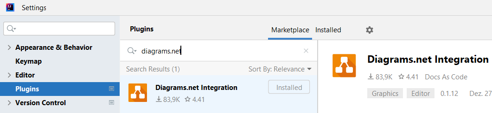

# SWEN1-WIN (Prof. Schneider), Blatt 3

Abgabe bis 7.11.

## Aufgabe 1, Package currency

a) Vervollständigen Sie die Enum `Currency`, indem Sie `EUR`, `USD` und zwei
weitere Währungen `CHF` (Scheizer Franken) und `JPY` (Japanische Yen) hinzufügen. Die Enum soll außerdem ein privates Attribut
`euroConversionFactor` haben, welches den Umrechnungsfaktor zu Euro angibt.
Diese Werte werden als double-Wert gesetzt. Man kann diesen Wert dann über eine
öffentliche `getEuroConversionFactor`-Methode abfragen.

b) Vervollständigen Sie nun die `convert`-Funktion in `Conversion`, die
beliebige
Währungen umrechnet und dabei über den Euro-Kurs geht (also erst in `EUR`
umtauscht und dann in die andere Währung).

So soll z.B. `convert(5.00, Currency.DOLLAR, Currency.EURO)`
zurückliefern, wie viel 5 US-Dollar in Euro sind.

**Wichtig**: Benutzen Sie zum Umrechnen (insbesondere auch innerhalb von
convert) keine Fallunterscheidung (if oder switch), sondern arbeiten Sie alleine
mit den `euroConversionFactor`-Werten.

c) Legen Sie (im richtigen Verzeichnis!) eine Unit-Test-Klasse `ConversionTest`
an, welche verschiedene Umrechnungen testet. Jede Währung soll mindestens in
einem Test vorkommen. Sie können in dieser Testklasse die statische
`convert`-Methode der Klasse `Conversion` direkt über `Conversion.convert(...)`
aufrufen und müssen keine Instanz von `Conversion` erzeugen. Denken Sie daran,
dass Sie bei `assertEquals` von double-Werten als dritten Parameter ein delta
angeben müssen.

Testen Sie neben einfacher Konvertierung auch die Hin- und Rückkonvertierung:
Rechnen Sie dazu einen Betrag von Dollar nach Euro um und speichern Sie das
Ergebnis in einer Variablen. Anschließend konvertieren Sie diesen Betrag wieder
zurück nach Dollar und vergleichen ihn mit dem Ursprungsbetrag.

Hinweis: Für diese Übungsaufgabe haben wir Geldbeträge in double-Variablen
gespeichert. Allerdings sollte man aufgrund mangelnder Genauigkeit von double
für Geldbeträge eigentlich
[BigDecimal](https://docs.oracle.com/en/java/javase/11/docs/api/java.base/java/math/BigDecimal.html)
nehmen.

d) *Diese Aufgabe ist freiwillig - machen Sie diese nur, wenn Sie alle anderen
Aufgaben erledigt haben:* Implementieren und testen Sie für Aufgabe 2
eine Methode

```
private static BigDecimal convert(BigDecimal amount, Currency from, Currency to)
```

Hintergrund: double-Werte sind ungenau. So gibt es z.B. keine exakte
Repräsentation von 0.1 als double-Zahl. Sie können das ausprobieren, in dem Sie
einmal folgenden Code ausführen:

```
double tenCent = 0.1;
double sum = 0.0;
for (int i = 0; i < 20; i++) {
    sum = sum + tenCent;
    System.out.println(sum);
}

BigDecimal tenCentBd = new BigDecimal("0.1");
BigDecimal sumBd = BigDecimal.ZERO;
for (int i = 0; i < 20; i++) {
    sumBd = sumBd.add(tenCentBd);
    System.out.println(sumBd);
}
```

## Aufgabe 2, Package university

a) Vervollständigen Sie die Klasse University. Legen Sie folgende Attribute an:

- "Name der Hochschule"
- "Stadt"
- "Universitätstyp" mit folgenden Möglichkeiten: University of applied science,
  Technical university, University
- "Anzahl Studierende"
- "Anzahl Fakultäten"
- "Jahr der Gründung"

Wählen Sie **englische** Namen für die Attribute. Wählen Sie einen
**geeigneten Datentyp**. Sie können hierfür auch neue Typen erstellen. Alle
Attribute sollen `private` sein.

b) Erweitern Sie University um einen Konstruktor (mit allen Attributen),
get-Methoden für alle Attribute, set-Methoden für alle Attribute

c) Implementieren Sie `equals`, `hashCode` und `toString`

d) Schreiben Sie eine Methode `toDisplayString()`: Dies soll einen gut lesbaren
String mit dem Inhalt aller Attribute zurückliefern, etwa
`"Regenbogen-Hochschule (University of applied science) in Wolkenburg mit 4132 Studierenden an 3 Fakultäten, gegründet im Jahr 1344"`

e) Erstellen Sie eine Builder-Klasse für `University`.

f) Erstellen Sie einen
Copy-Konstruktor `public University(University universitiyToCopyFrom) { ... }`

## Aufgabe 3, Package university (Tests)

Schreiben Sie Unit-Test-Methoden in einer
Klasse `test/exercise04/university/UniversityTest.java`:

a) `testToStringAndDisplayString()`: Erstellen Sie eine University-Instanz für
die
HTWG ([mit echten Werten](https://de.wikipedia.org/wiki/Hochschule_Konstanz_Technik,_Wirtschaft_und_Gestaltung)!)
. Testen Sie, dass `toString()` und `displayString()` die richtigen Rückgaben
liefern.

b) `testConstructorEqualsBuilder()`: Erstellen Sie zwei Instanzen für die HTWG.
Eine Instanz soll per Konstruktor, die andere Instanz über den Builder erzeugt
werden. Testen Sie das Ergebnis von `equals()` (erste Instanz mit zweiter
Instanz) auf `true` mittels `Assert.assertTrue(...)`. Ändern Sie nun den
Universitäts-Typ von einer Instanz. Jetzt sollte `equals` den Wert `false`
zurückliefern. Testen Sie dies mittels `Assert.assertFalse(...)`.

c) `testCopyConstructor()`: Erstellen Sie eine `University`-Instanz für die
HTWG. Erstellen Sie eine zweite Instanz, indem Sie den Copy-Konstruktor mit
dieser Instanz aufrufen. Testen Sie das Ergebnis von `equals()` (erste Instanz
mit zweiter Instanz) auf `true` mittels `Assert.assertTrue(...)`. Ändern Sie nun
die kopierte Instanz über die Setter-Methoden zur Uni Konstanz. Rufen Sie erneut
`equals()` auf beiden Instanzen auf und testen Sie, dass hier das korrekte
Ergebnis (nämlich welches?) zurückgeliefert wird.

## Aufgabe 4, Package university (Assoziation, UML)

a) Sie finden im package `university` auch eine `Student`-Klasse, neben Vor- und
Nachname auch als Attribut die Universität/Hochschule hat, an welcher der
Student / die Studentin studiert. Legen Sie zwei `Student`-Instanzen an (z.B.
für
Ihre beiden Team-Mitglieder) und geben Sie das Ergebnis der `toString`-Methode
auf der Konsole aus.

b) Falls noch nicht erledigt,
installieren Sie in IntelliJ die "Diagrams.net Integration". Das geht über
File -> Settings. Dort finden Sie unter Plugins mit einer entsprechenden
Suche die Erweiterung:



Öffnen Sie anschließend die Vorlage
[university/UML-University.drawio.png](university/UML-University.drawio.png)
für ein UML-Klassen-Diagramm.

c) Legen Sie in der Vorlage ein UML-Klassen-Diagramm mit `University`,
`Student` und (falls vorhanden) Enums aus dem Package `university` an.
Modellieren Sie lediglich
die **Attribute** (und **Enum-Konstanten**, falls vorhanden)
der Klassen, die **Vererbungsbeziehungen** und
**Attribut-Assoziationen**. Sie können also alle Methoden und Konstruktoren
weglassen.

Achten Sie darauf, dass das UML-Diagramm mit in Git committet wird.
